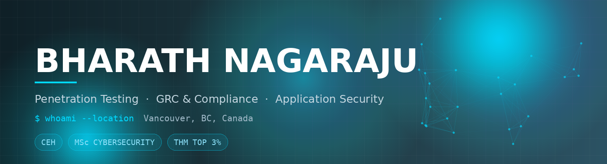
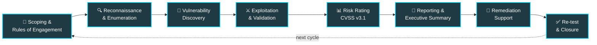

<div align="center">



<a href="https://www.linkedin.com/in/bharath-nagaraju-cybersecurity"></a>
<a href="https://tryhackme.com/p/BatBAN"></a>
<a href="mailto:bharath.nagaraju98@gmail.com"></a>


</div>

<br/>

## `whoami`

```python
class BharathNagaraju:
    def __init__(self):
        self.role         = "Cybersecurity Analyst @ Livingston International"
        self.location     = "Vancouver, BC, Canada"
        self.education    = "MSc Cybersecurity — NYIT Vancouver"
        self.focus        = ["Web & API Pentesting", "GRC & Compliance", "AppSec"]
        self.frameworks   = ["PCI-DSS", "ISO 27001", "NIST CSF", "SOX"]
        self.open_to_work = True

    def philosophy(self):
        return "A finding without a fix is just a complaint."
```

Four years across offensive security, compliance, and security operations. I test web applications, APIs, and network infrastructure, validate controls against PCI-DSS and ISO 27001, and work with engineering teams to actually close what I find — then re-test to prove it stayed closed. Previously a penetration tester at Emedpractice in India.

Most security people pick a side: break things, or govern things. I do both, and the overlap is where the interesting work lives — a pentest finding that maps cleanly to a failed control is worth ten that don't.

<br/>

## `impact --summary`

<table width="100%">
<tr>
<td align="center" width="33%"><h1>50+</h1><b>Pentest Reports</b><br/><sub>Assessments &amp; executive summaries<br/>delivered annually</sub></td>
<td align="center" width="33%"><h1>35+</h1><b>PCI-DSS Controls</b><br/><sub>Implemented and validated<br/>for audit readiness</sub></td>
<td align="center" width="33%"><h1>30+</h1><b>Vulnerabilities Closed</b><br/><sub>Remediated with engineering<br/>and confirmed by re-test</sub></td>
</tr>
<tr>
<td align="center"><h1>15+</h1><b>Web &amp; API Tests</b><br/><sub>Full-scope application<br/>penetration tests</sub></td>
<td align="center"><h1>20%</h1><b>Alert Noise Reduced</b><br/><sub>Through SIEM tuning and<br/>triage improvements</sub></td>
<td align="center"><h1>4+</h1><b>Years Experience</b><br/><sub>Offense, defense,<br/>and compliance</sub></td>
</tr>
</table>

<br/>

## `cat methodology.md`

How I run an engagement, start to finish:



The last two steps are the ones most reports skip. A vulnerability isn't closed when you write it up — it's closed when a developer ships the fix and you prove the exploit no longer works.

<br/>

## `nmap -sV ~/expertise`

<table width="100%">
<tr>
<th width="33%">⚔️ Offensive Security</th>
<th width="33%">📋 Governance & Compliance</th>
<th width="33%">🛡️ Security Operations</th>
</tr>
<tr valign="top">
<td>

- Web application penetration testing
- REST & API security assessment
- Network & infrastructure testing
- Authentication & session testing
- Privilege escalation
- Manual exploitation & PoC development
- CVSS v3.1 risk rating
- Technical & executive reporting

</td>
<td>

- PCI-DSS control implementation
- Control gap analysis
- ISO 27001 & NIST CSF alignment
- SOX IT general controls
- Audit evidence collection
- Risk register maintenance
- Security policy development
- Third-party risk review

</td>
<td>

- Splunk SIEM monitoring
- Alert correlation & tuning
- Incident triage & containment
- False-positive reduction
- Log source onboarding
- Threat modeling
- Vulnerability management
- Remediation tracking

</td>
</tr>
</table>

<br/>

## `cat owasp-top10.json`

What I actually look for on a web app engagement:

| Class | What I'm testing for | Primary tooling |
| :--- | :--- | :--- |
| **Broken Access Control** | IDOR, forced browsing, missing function-level checks, horizontal & vertical privilege escalation | Burp Suite, manual |
| **Injection** | SQLi, NoSQLi, command injection, LDAP injection, template injection | SQLMap, Burp, manual |
| **Cryptographic Failures** | Weak TLS config, plaintext transmission, weak hashing, hardcoded secrets | testssl, Burp, Nessus |
| **Insecure Design** | Missing rate limiting, weak business-logic controls, unsafe workflows | Threat modeling, manual |
| **Security Misconfiguration** | Default credentials, verbose errors, exposed admin panels, missing headers | Nessus, Nmap, Nikto |
| **Vulnerable Components** | Outdated libraries, known CVEs, unmaintained dependencies | Nessus, dependency scanning |
| **Auth Failures** | Credential stuffing exposure, weak session handling, MFA bypass, token flaws | Hydra, Burp, manual |
| **SSRF** | Internal service access, cloud metadata exposure, blind SSRF via out-of-band | Burp Collaborator, ffuf |
| **API Security Top 10** | BOLA, broken object property authorization, unrestricted resource consumption | Burp, Postman, manual |

<br/>

## `compliance --frameworks`

| Framework | My role | What I produce |
| :--- | :--- | :--- |
|  | Control implementation & validation | Control test results, evidence packages, remediation plans |
|  | Gap analysis & Annex A alignment | Gap assessments, control mappings, risk treatment input |
|  | Maturity assessment & posture review | Function-level scoring, roadmap recommendations |
|  | IT general controls support | Access review evidence, change management validation |
|  | Safeguards review (healthcare sector) | Technical safeguard assessments |

<br/>

## `ls -la ~/projects`

| Repository | Focus | Status | What's inside |
| :--- | :--- | :--- | :--- |
| [**ban-compliance-audit**](https://github.com/Batban18/ban-compliance-audit) | `AI Security` |  | MCP server bridging AI assistants to compliance tooling |
| **pentest-report-library** | `Offensive` |  | Report templates and worked assessments — scoping, CVSS-rated findings, PoC evidence, retest logs |
| **owasp-labs** | `AppSec` |  | OWASP Top 10 & API Top 10 by vulnerability class — exploit walkthrough, secure code fix, detection guidance |
| **pci-dss-control-toolkit** | `GRC` |  | PCI-DSS v4.0 control mapping, PCI ↔ ISO 27001 ↔ NIST CSF crosswalk, evidence-collection scripts |
| **ml-intrusion-detection** | `Research` |  | Code and notebooks reproducing my published IDS research |
| **splunk-detections** | `Blue Team` |  | SPL detections mapped to MITRE ATT&CK, with tuning notes on cutting alert noise |

<br/>

## `cat /opt/toolkit`

<table width="100%">
<tr>
<td width="20%"><b>⚔️ Offensive</b></td>
<td>


</td>
</tr>
<tr>
<td><b>🛡️ Defensive</b></td>
<td>


</td>
</tr>
<tr>
<td><b>💻 Platforms</b></td>
<td>


</td>
</tr>
<tr>
<td><b>⌨️ Code</b></td>
<td>


</td>
</tr>
</table>

<br/>

## `history | tail`

```bash
$ current --focus
→ Building out the pentest report library — turning engagement
  experience into templates other people can actually use

$ learning --now
→ Deepening API security testing beyond the OWASP API Top 10
→ MCP and AI-assisted security tooling
→ Cloud security posture (AWS / Azure) to close the gap between
  what I've deployed and what I've formally assessed

$ next --up
→ PCI-DSS v4.0 control toolkit with working evidence scripts
→ Publishing the ML intrusion detection research code
```

<br/>

## `certs --list`

<table width="100%">
<tr>
<td width="25%" align="center"><b>🎯 CEH</b><br/><sub>Certified Ethical Hacker<br/>EC-Council</sub></td>
<td width="25%" align="center"><b>🛡️ Google Cybersecurity</b><br/><sub>Professional Certificate<br/>Google / Coursera</sub></td>
<td width="25%" align="center"><b>⚔️ Jr. Penetration Tester</b><br/><sub>Learning Path<br/>TryHackMe · Top 3%</sub></td>
<td width="25%" align="center"><b>🎓 MSc Cybersecurity</b><br/><sub>New York Institute<br/>of Technology, Vancouver</sub></td>
</tr>
</table>

<br/>

## `cat research.bib`

> 📄 **Machine Learning For Cybersecurity: Enhancing Intrusion Detection Systems And Threat Mitigation**
>
> *International Journal of Multidisciplinary Engineering In Current Research* · February 2025
>
> Applying supervised learning to network intrusion detection — feature selection, model comparison, and the practical gap between benchmark accuracy and production false-positive rates.

<br/>

<div align="center">

## Open to cybersecurity roles across Canada

**Penetration Tester** · **AppSec Engineer** · **GRC Analyst** · **Security Analyst**

<a href="https://www.linkedin.com/in/bharath-nagaraju-cybersecurity"></a>
<a href="mailto:bharath.nagaraju98@gmail.com"></a>
<a href="https://tryhackme.com/p/BatBAN"></a>

<br/><br/>

<sub>Everything published here is built against legal targets, public datasets, and deliberately vulnerable applications.<br/>No client, employer, or third-party data appears in any repository.</sub>

</div>
